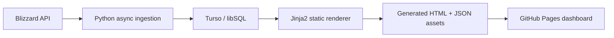

# Azeroth’s Most Wanted Armory

Azeroth’s Most Wanted Armory is a portfolio-grade guild intelligence dashboard and automation pipeline for a World of Warcraft Classic guild. It combines Python async ingestion, Turso/libSQL over HTTP, Jinja2-based static rendering, GitHub Actions automation, and a mobile-friendly client-side dashboard to turn live Blizzard data into a polished officer-facing portal.

## Live Dashboard

[View the live dashboard](https://azeroths-most-wanted.eu.org/)

## What This Project Demonstrates

- API ingestion and normalization from the Blizzard API.
- Async data-pipeline design with throttled character fetches.
- Persistent storage in Turso/libSQL rather than ephemeral API output.
- Static site generation with Jinja2 templates.
- Automation and deployment through GitHub Actions and GitHub Pages.
- Mobile-first dashboard UX with client-side filtering, routing, and search.
- Defensive rendering for incomplete roster data and partial profile payloads.
- Source, unit, and local preview validation before publication.

## Architecture Overview



The pipeline is intentionally simple:

1. Python collects roster, character, timeline, and campaign data from Blizzard and the project database.
2. The data is normalized into a current roster snapshot plus historical records.
3. Turso/libSQL stores roster state, timelines, movement, campaign history, and other snapshots that should not live only in API responses.
4. Jinja2 renders the dashboard shell and embeds the data needed by the client-side experience.
5. GitHub Pages serves the generated static site, while GitHub Actions coordinates refresh, validation, and deployment. In this repository the refresh workflow is exposed as `workflow_dispatch`.

## Data Pipeline

The repository’s pipeline is designed around a refresh-and-render model rather than a live application server.

- `main.py` authenticates against Blizzard, loads stored state, fetches guild and character data, and writes the generated outputs.
- `wow/` contains the ingestion, normalization, history, badge, campaign, officer-brief, and war-effort logic.
- `render/html_dashboard.py` assembles the final HTML document and injects the generated CSS, JS, and JSON payloads.
- `render/script.js` powers the client-side interactions once the static page loads.
- `tests/` protects the data pipeline, renderer, and layout behavior with source-level checks.

The key outputs are:

- current roster state
- raw roster snapshots
- timeline/history data
- campaign archive data
- movement summaries
- officer brief summaries
- the generated `index.html` dashboard
- JSON assets under `asset/`

## Storage Model

Turso/libSQL is used to keep the project stateful without needing a traditional backend service.

It stores:

- current roster rows
- gear and character state
- historical snapshots
- timeline events
- campaign/archive records
- movement and summary data used by the dashboard

That separation makes the dashboard more than a single API pull. It can compare current state against previous snapshots and surface meaningful historical context.

## Dashboard Features

The generated site currently includes:

- roster intelligence and summary metrics
- a character dossier / full-card profile view
- War Effort tracking and campaign history
- Analytics cards for roster composition, progression, readiness, and tempo
- Hall of Heroes recognition and campaign footprint views
- search, filtering, and route-driven navigation on the client side
- mobile navigation with hamburger/menu behavior
- defensive rendering for partial roster profiles and missing fields

The UI is designed to be officer-friendly: it emphasizes readiness, movement, recognition, and roster signals rather than broad consumer-facing polish.

## Reliability and Validation

The repository uses several layers of validation:

- unit tests for the data pipeline and render helpers
- local preview generation before shipping source changes
- GitHub Actions validation before the credentialed data-refresh step
- fail-fast configuration checks for Blizzard and Turso environment setup
- generated-output boundaries so source and publish artifacts stay separate

## Local Validation

Use these commands from the repository root:

```powershell
.\venv\Scripts\python.exe -m unittest discover -v
.\tools\preview-local.ps1 -NoServe
```

The helper below is also available for a fuller local maintenance pass:

```powershell
.\tools\validate-local.ps1
```

If you need to run the pipeline directly, remember that `main.py` is the credentialed integration path, not the normal offline validation path.

## Required Environment Variables

The live pipeline expects these variables:

- `BLIZZARD_CLIENT_ID`
- `BLIZZARD_CLIENT_SECRET`
- `TURSO_DATABASE_URL`
- `TURSO_AUTH_TOKEN`

Never commit real secrets to the repository.

## Repository Boundaries

Source lives under:

- `render/`
- `wow/`
- `tests/`
- `.github/workflows/`
- `main.py`

Generated output lives at:

- the repository-root `index.html`
- the `asset/` directory

Those generated files are part of the build output and should not be edited by hand. If a local preview or pipeline run updates them, restore them before committing:

```powershell
git restore index.html asset
```

## Current Boundaries and Non-Goals

This project is intentionally not:

- a general-purpose SaaS product
- a real-time live service with per-user backend sessions
- a frontend framework showcase
- a manually maintained static site

It is a refresh-driven portfolio system: data is collected, normalized, stored, rendered, and published on a repeatable cadence.

## Project Notes

The public README is now written as an architecture case study instead of a generic setup guide. That makes it easier to evaluate the system as a portfolio piece and keeps the GitHub mobile view readable without large logo blocks or wide image grids.

---

*World of Warcraft, Warcraft, and Blizzard Entertainment are trademarks or registered trademarks of Blizzard Entertainment, Inc. in the U.S. and/or other countries. This is a community project and is not affiliated with, endorsed by, or sponsored by Blizzard Entertainment.*
